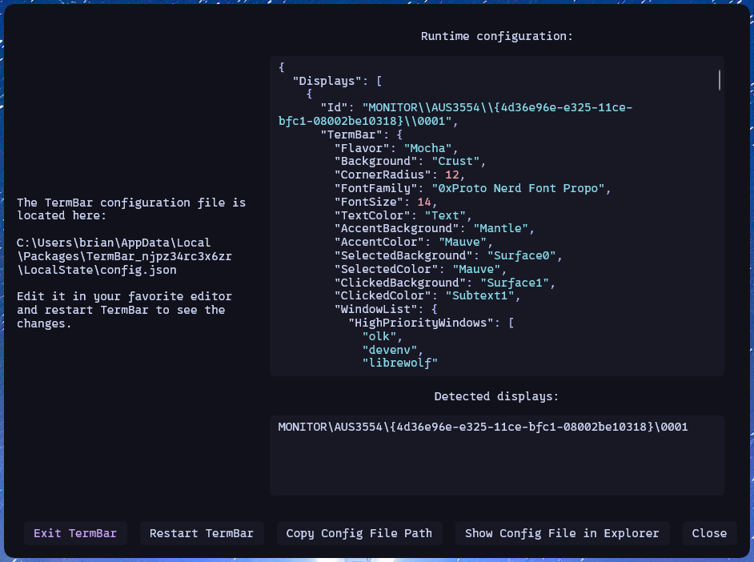
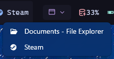

# TermBar
TermBar is a window manager with a terminal, inspired heavily by [catppuccin for rainmeter](https://github.com/modkavartini/catppuccin). It's a bar that goes on the top or bottom of your screen and is meant to replace the taskbar. TermBar is extremely customizable and uses the [Catppuccin palette](https://catppuccin.com/palette/) throughout.

TermBar is a C# WinUI 3 application for .NET 8.0 and is available as pre-built x64 and ARM64 packaged app releases, signed with a self-signed certificate. It runs on Windows 11 and should support Windows 10 as well, though I haven't tested it.


## Features
TermBar implements a modular approach to customization: you control which modules are displayed, how many times they're displayed, how they're displayed, and in which order they're displayed.

Right clicking TermBar presents a menu that can open the settings window or Task Manager.

### Modules
Each of these modules is described in its own section below.

| Module          | Description                                                                   |
| --------------- | ----------------------------------------------------------------------------- |
| Clock           | A clock to show the time, plus a calendar that's displayed when you click it. |
| Cpu             | A CPU usage monitor.                                                          |
| Gpu             | A GPU usage monitor.                                                          |
| Launcher        | A set of launcher buttons, a lot like items pinned to the Windows 11 taskbar. |
| Memory          | A memory usage monitor.                                                       |
| StaticText      | A simple static text display.                                                 |
| SystemDropdown  | A drop-down menu providing access to system commands.                         |
| Terminal        | A fully functional terminal emulator.                                         |
| Volume          | A system volume level monitor that can adjust volume and mute.                |
| WindowBar       | A taskbar-like list of all open windows.                                      |
| WindowDropdown  | Like WindowBar, but shows open windows as a drop-down menu.                   |

### Appearance
Deeply integrating the Catppuccin palette, TermBar supports any of the four Catppuccin flavors to adjust its entire look and feel: Latte, Frappé, Macchiato, and Mocha. TermBar is designed to work with your favorite [Nerd Font](https://www.nerdfonts.com/) and can take advantage of its 10,000+ glyphs. It comes configured beautifully out of the box with the 0xProto Nerd Font and the Mocha theme, ready to be customized as much as you like.

TermBar does not use any icons; it uses Nerd Font glyphs instead. It's designed to fit in with the look and feel of your favorite terminal emulator or minimalist desktop environment. By default, it runs on a single monitor, but can be customized to run on as many monitors as you'd like, with a separate configuration for each one. TermBar intentionally does not change its appearance based on the system Light/Dark setting.

### Window Tracking
Window tracking is highly customizable, including color and icon customization, group sorting, and window prioritization. It supports regular expressions to match window titles and select an icon based on matches, letting you easily tell apart multiple windows with the same process.

## Limitations
TermBar is not a shell replacement and does not attempt to "take over" the taskbar. I recommend turning on "Automatically hide the taskbar." While TermBar implements all of the functionality of the taskbar I use the most, it notably does not implement the system tray or Notifications. It also does not have several integrations the taskbar does, like the Start menu, task view, widgets, badges, network settings, Bluetooth settings, IME switching, or Windows Update integration.

In recent years, the taskbar and Explorer have become much more deeply integrated with Windows than in previous versions, making shell replacement rather treacherous territory. I may consider implementing more of these features in the future.

## Similar Projects
- [Rainmeter](https://github.com/rainmeter/rainmeter/), which is nearly infinitely customizable (with another mention of [catppuccin for rainmeter](https://github.com/modkavartini/catppuccin))
- [Cairo Desktop Environment](https://github.com/cairoshell/cairoshell/), which is a true shell replacement
- [Stardock ObjectDock](https://www.stardock.com/products/objectdock/), paid software

## License
TermBar is released under the MIT License. It utilizes third-party licensed components; see [THIRD-PARTY-NOTICES.md](THIRD-PARTY-NOTICES.md) for details.

## Configuration
TermBar uses a JSON configuration file. When first starting, it creates a default configuration file in the packaged app's `LocalState` directory. Right click TermBar to open its settings and see the location of this file, plus the current runtime configuration. TermBar never writes to the configuration file unless it doesn't exist, so you own it and manage it.



In the [schema](schema/) directory, the TermBar configuration schema is available, including descriptions, defaults, and allowed ranges. A markdown file containing a human-readable description of the schema is also available.

### The WindowList
The WindowList configures three important things: window prioritization, group sorting, and the ProcessIconMap.

Window prioritization can be configured using HighPriorityWindows and LowPriorityWindows, each of which is an array of process names. Note that these process names cannot end with an extension. Windows with process names in HighPriorityWindows will be pinned to the beginning of any modules that list windows in the order they are listed. The same applies to LowPriorityWindows, but at the end of the list. Windows with process names in neither list are displayed after the high-priority section and before the low-priority section in the order that Windows tracks them.

Within each group of windows associated with the same process, SortGroupsAlphabetically can be used to sort them alphabetically; otherwise, they appear in the same order that Windows tracks them.

The ProcessIconMap is an array used to map window process names to icons and icon colors. It can optionally, for a process name, apply a regular expression against the window title to select icons and icon colors using each entry's WindowNameIconMap. As with HighPriorityWindows and LowPriorityWindows, process names cannot end with `.exe`.

## Modules
This section describes each of the TermBar modules.

### Clock Module
The Clock module displays the current time in a configurable format and optionally can pop out a calendar when clicked. The time is refreshed at a configurable interval and the calendar's date formats are customizable. The calendar uses the system's settings to determine the first day of the week.


### Cpu Module
The Cpu module displays the current CPU load, refreshing at a configurable interval. The percentage can be formatted. This value is obtained via
[LibreHardwareMonitorLib](https://github.com/LibreHardwareMonitor/LibreHardwareMonitor/).


### Gpu Module
The Cpu module displays the current CPU load, refreshing at a configurable interval. The percentage can be formatted. This value is obtained via [LibreHardwareMonitorLib](https://github.com/LibreHardwareMonitor/LibreHardwareMonitor/). This currently only works for NVIDIA graphics cards, though LibreHardwareMonitorLib supports AMD and Intel graphics cards as well; I simply have neither to test against.


### Launcher Module
The Launcher module presents a set of buttons that can be used to shell execute configurable items. Both the command and arguments are configurable and have environment variables replaced with their values. Anything that is launchable via Explorer should be launchable here.

Launcher entry icons can be defined specifically in the Launcher module configuration, then are checked against the WindowList's ProcessIconMap. If a match is found, the icon and color defined there are used. If not, the default icon and color defined in the Launcher module configuration are used.


### Memory Module
The Cpu module displays the current memory load, refreshing at a configurable interval. The percentage can be formatted. This value is obtained via [LibreHardwareMonitorLib](https://github.com/LibreHardwareMonitor/LibreHardwareMonitor/).


### StaticText Module
The StaticText module displays a static text string, with an optional icon.


### SystemDropdown Module
The SystemDropdown module provides a menu providing system commands, like shutting down, rebooting, and opening the Windows settings. It can be configured to customize which options are displayed.


### Terminal Module
The Terminal module embeds an instance of [Furminal](https://github.com/spakov/furminal)'s **TerminalControl**, a fully functional terminal emulator, in TermBar. The Terminal module is presented with three rows and 60 columns by default, but can be configured to any size you like. **Terminal** is extensively customizable; see its GitHub page for details. Right click the Terminal module to access its context menu.

By default, the Terminal module uses the same font family and font size used by TermBar, but this can be overridden if desired. The Terminal module implements its own context menu from **Furminal**.


### Volume Module
The Volume module displays and optionally allows controlling the system default device's volume level. The volume level can be formatted.


### WindowBar Module
The WindowBar module displays and allows changing the active window on the desktop. Its appearance is customizable, including the size of each window in the window bar. The icons and icon colors of each window are configured via the WindowList.


### WindowDropdown Module
The WindowDropdown module is far more compact than the WindowBar module, but also displays and allows changing the active window on the desktop via a drop-down menu. The icons of each window are configured via the WindowList.




## Installing
1. Install the latest code-signing certificate from [certificates](certificates/) into **Local Machine** > **Trusted Root Certification Authorities**.
2. Grab the latest [release](https://github.com/spakov/furminal/releases) for x64 or ARM64, depending on your platform.
3. Double click the MSIX package and install it.

## Architecture
There are several major components of TermBar:
- **TermBar**, the application itself
  - **Catppuccin**, a library exposing the [Catppuccin palette](https://catppuccin.com/palette/) in .NET
  - **EndpointVolumeInterop**, a library facilitating interfacing with the
    Windows default audio device volume level
  - **Terminal**, the terminal emulator control

### TermBar
TermBar is a WinUI 3 application, written in C#, targeting .NET 8.0 and Windows 10 10.0.19041.0 ("20H1") or newer, supporting the x64 and ARM64 architectures. It is intended to be built as an MSIX package. It uses the following NuGet packages:
- Community.Toolkit.Mvvm
- CommunityToolkit.WinUI.Extensions
- Karambolo.Extensions.Logging.File
- LibreHardwareMonitorLib
- Microsoft.Extensions.Logging
- Microsoft.Graphics.Win2D
- Microsoft.Windows.CsWin32
- Microsoft.Windows.SDK.BuildTools
- Microsoft.WindowsAppSDK
- System.Memory
- System.Runtime.CompilerServices.Unsafe
- System.Text.Json

### Catppuccin
Catppuccin exposes the Catppuccin palette as a set of classes encapsulating and describing Catppuccin's `palette.json` for use with WinUI 3. It is generated by **CatppuccinGenerator**.

Catppuccin uses the following NuGet packages:
- Microsoft.WindowsAppSDK

CatppuccinGenerator uses the following NuGet packages:
- System.CommandLine

### EndpointVolumeInterop
EndpointVolumeInterop is a simple C++ DLL that encapsulates COM interaction with the Windows audio API. It is used by TermBar via P/Invoke.

### Terminal
Terminal is a part of [Furminal](https://github.com/spakov/furminal).

## Building
1. Clone **Furminal** with `git clone --recurse-submodules https://github.com/spakov/furminal.git`.
2. Clone this repository with `git clone --recurse-submodules https://github.com/spakov/termbar.git`.
3. Ensure `furminal` and `termbar` have been cloned side by side (i.e., in the same containing directory).
4. Open `Furminal.sln` in Visual Studio.
5. Open `TermBar.sln` in Visual Studio.
6. Build TermBar.

### Packaging as MSIX
Right click the TermBar project in Visual Studio and select **Package and Publish** > **Create App Packages…**.

## Certificate Information
Certificates that have been used by TermBar are listed below. These are located in [certificates](certificates/).

These certificates are the public portion of certificates generated with the following command:
`New-SelfSignedCertificate -Type Custom -KeyUsage DigitalSignature
-KeyAlgorithm RSA -KeyLength 2048 -CertStoreLocation Cert:\CurrentUser\My
-TextExtension @("2.5.29.37={text}1.3.6.1.5.5.7.3.3", "2.5.29.19={text}")
-Subject "CN=spakov" -FriendlyName "TermBar"`

### `7494A215F4A051D5BE99762306737E45CF6F678C` (current)
```
Get-ChildItem Cert:\LocalMachine\TrustedPeople\7494A215F4A051D5BE99762306737E45CF6F678C | Select-Object -Property * -ExcludeProperty "PS*" | Out-String

EnhancedKeyUsageList     : {Code Signing (1.3.6.1.5.5.7.3.3)}
DnsNameList              : {spakov}
SendAsTrustedIssuer      : False
EnrollmentPolicyEndPoint : Microsoft.CertificateServices.Commands.EnrollmentEndPointProperty
EnrollmentServerEndPoint : Microsoft.CertificateServices.Commands.EnrollmentEndPointProperty
PolicyId                 : 
Archived                 : False
Extensions               : {System.Security.Cryptography.Oid, System.Security.Cryptography.Oid, System.Security.Cryptography.Oid, System.Security.Cryptography.Oid}
FriendlyName             : 
HasPrivateKey            : False
PrivateKey               : 
IssuerName               : System.Security.Cryptography.X509Certificates.X500DistinguishedName
NotAfter                 : 05-Jul-2026 11:35:58
NotBefore                : 05-Jul-2025 11:15:58
PublicKey                : System.Security.Cryptography.X509Certificates.PublicKey
RawData                  : {48, 130, 3, 0…}
RawDataMemory            : System.ReadOnlyMemory<Byte>[772]
SerialNumber             : 5B0BA673F9690D8C4ACE9DA9E06A25EA
SignatureAlgorithm       : System.Security.Cryptography.Oid
SubjectName              : System.Security.Cryptography.X509Certificates.X500DistinguishedName
Thumbprint               : 7494A215F4A051D5BE99762306737E45CF6F678C
Version                  : 3
Handle                   : 1417340013808
Issuer                   : CN=spakov
Subject                  : CN=spakov
SerialNumberBytes        : System.ReadOnlyMemory<Byte>[16]
```
